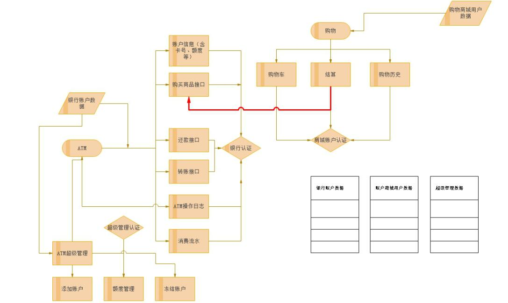

##程序主要分为两个模块：ATM、购物商城
####一、测试前可运行根目录下的setup.py文件，可以初始化测试数据：
####1.购物商城：
用户名：`aric,alex,shanshan,zhang`，密码都是：`123456`
####2.ATM用户
账号：`0123456789，1122334455`，密码都是：`123456`
####3.ATM超级管理
用户：`admin`  密码：`admin`

####二、测试说明
1、ATM用户操作入口请运行:`atm/main.py`，银行卡号登陆后，菜单也有购物商城、和ATM超级管理的入口 
2、单独运行购物商城模块可运行:`shopping_mall/main.py` 
3、单独运行ATM超级管理模块可运行:`atm/admin.py` 

####三、流程图

